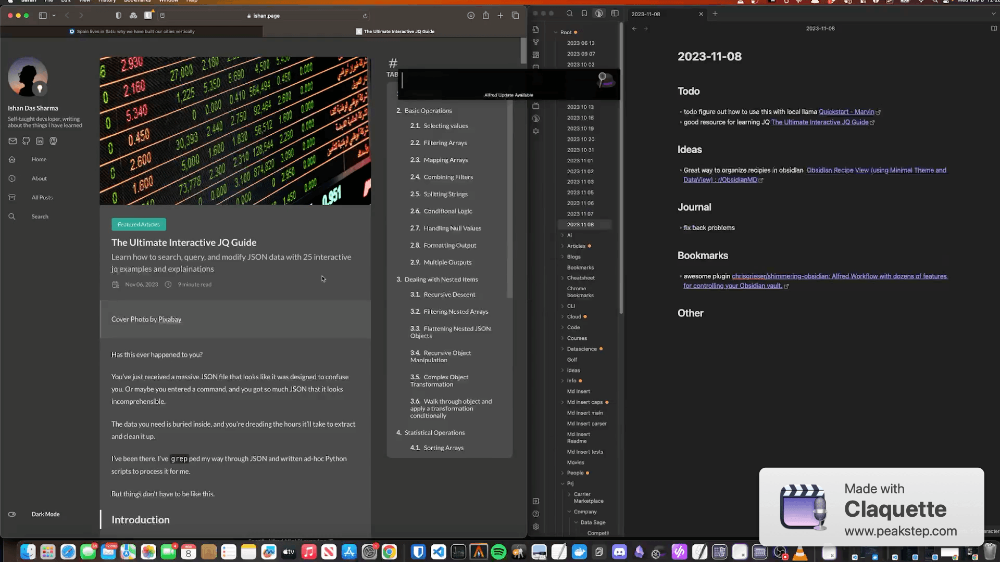

# Alfred Note Capture
An [Alfred](https://www.alfredapp.com/) workflow for capturing ideas, notes, links, todos, and even browser tabs directly to your notes without context switching.

## Setup 
Workflow configuration:
1. Set all variables
    - vault path
    - daily note format
2. Setup daily note template. Currently, the workflow requires some hard coded headers as shown below. In the future I plan to make this configurable.


Copy the following into your dailynote template. Note - you **CAN** Add more content above and below these headers. The workflow looks for an H2 of Todo/Ideas/Journal/Bookmakrs.

```
## Todo

## Ideas

## Journal

## Bookmarks

## Other
```

## Features
- Browser related:
    - Copy current browser tab as a markdown link
    - Append current browser tab to your daily notes
        - Default (`Return`) is for `## Bookmarks` header
        - `Shift+return` for Todo header
        - `Control+return` for Ideas header
    - Search current browser tab in your notes
- Thought capture:
    - `ji` Append a bullet to `## Ideas` header
    - `jj` Append a bullet to `## Journal` header
    - `jt` Append to `## Todo` header

## Examples

### Append A URL to daily note


### Append A URL to my Todos


### Insert a journal note


### Insert a todo note



## Future changes / todo
- Directly implmenent appending to a note
- Implement creating daily note if it does not exist